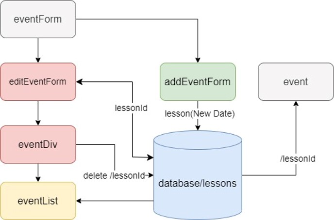
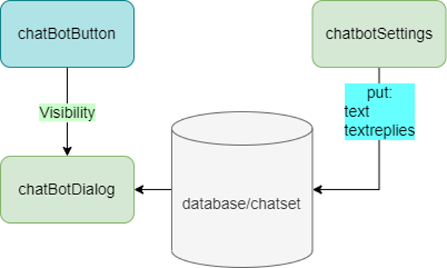

# denik253.github.io

## Features
1. Multi-page application in react.js.
2. There is an option for account authentication.
3. Registered user can create, edit and delete publications, customize chatbot assistant.
4. There is a preview window with title, description and image for each created publication.
5. Each publication can be opened and viewed in detail.
6. Firebase Authentication service is selected for registration.
7. Firebase Realtime Database service is selected for storing publication changes (adding, deleting, editing).
8. Markdown syntax is supported for entering text with formatting. html is also supported.
9. The user's authentication state is changed using local storage.

**PART 1**

**PART 2**

### Features of chatbot
1. The chatbot responds with the specified phrases to the specified queries.
2. If a match is found in one of the publications, the chatbot will reply with a text containing a hyperlink to the found publication, and the found match is highlighted in bold.

### How to work with text areas for chatbot?

#### Schemes of organization of website components and chatbot

